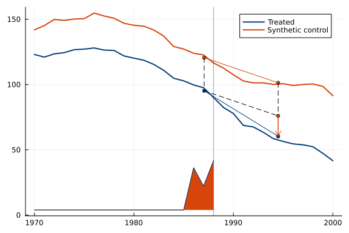
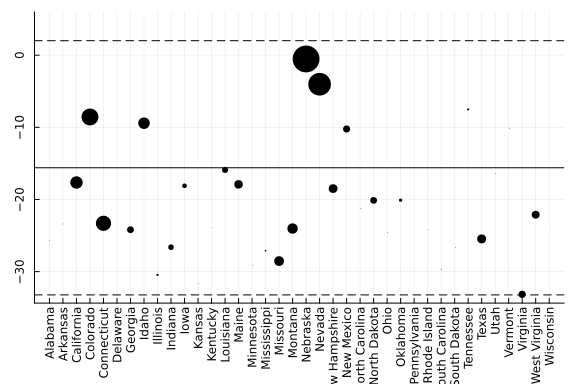

# Synthdid.JL

[](https://d2cml-ai.github.io/Synthdid.jl/stable/)
[](https://d2cml-ai.github.io/Synthdid.jl/dev/)
[](https://github.com/d2cml-ai/Synthdid.JL.jl/actions/workflows/CI.yml?query=branch%3Amaster)
[](https://codecov.io/gh/d2cml-ai/Synthdid.jl)


# synthdid: Synthetic Difference in Differences Estimation for Julia

This `Julia` package implements the synthetic difference-in-differences estimation procedure, along with a range of inference and graphing procedures, following Arkhangelsky et al., (2021).  Arkhangelsky et al. provide a code implementation in R, with accompanying materials here: [synthdid](https://synth-inference.github.io/synthdid/). 


This package is currently in beta and the functionality and interface is subject to change.

## Installation

```julia
using Pkg
Pkg.add("synthdid")
```


## Usage


```julia
using synthdid, Plots
```


## Inputs

+ `Y`: Outcome variable (numeric)
+ `N0`: Unit variable (numeric or string)
+ `T0`: Time variable (numeric)


# Example

Get data

```julia
setup_data = Synthdid.panel_matrices(Synthdid.data("california_prop99"));
```


Estimate `DID`

```julia
tau_hat = Synthdid.synthdid_estimate(setup_data.Y, setup_data.N0, setup_data.T0)
Synthdid.summary_synth(tau_hat, panel = setup_data);
```

```
synthdid: -15.604 +- NaN. Effective N0/N0 = 16.388/38~0.431. Effective T0/T
0 = 2.783/19 ~ 0.146. N1,T1 = 1, 12.
```


Plots treated and synthetic control trajectories.

```julia
p = Synthdid.synthdid_plot(tau_hat, year_unit_trayectory = setup_data.time)
plot(p["plot"])
```




Plots treated and synthetic control trajectories and overlays a 2x2 diff-in-diff diagram.

```julia
Synthdid.synthdid_units_plot(tau_hat, x_ticks = setup_data.names)
```




## Methods

### General methods

- `data("$(df)")`: Datasets
	- `california_prop99`: A dataset containing per-capita cigarette consumption (in packs).
	- `PENN` 
	- `CPS`

- `panel_matrices(panel::DataFrame; ...)`: Converts a data set in panel form to matrix format required by synthdid estimators
	- `panel`: A data.frame with columns consisting of units, time, outcome, and treatment indicator.
	- ...args
		- `unit`: The column number/name corresponding to the unit identifier. Default is 1.
		- `time`: The column number/name corresponding to the time identifier. Default is 2.
		- `outcome`: The column number/name corresponding to the outcome identifier. Default is 3.
		- `treatment`: The column number/name corresponding to the treatment status. Default is 4.
		- `treated`:.last Should we sort the rows of Y and W so treated units are last. If FALSE, sort by unit number/name. Default is TRUE.
	- `return`: 
		- A `panelMatrix` constructor with entries `Y`: the data matrix, `N0`: the number of control units, `T0`: the number of time periods before treatment, `W`: the matrix of treatment indicators, `names`: unit names vector, `time`: time vector.

- `vcov_synthdid_estimate(object; method="bootstrap", replications=200)`: Calculate Variance-Covariance Matrix for a Fitted Model Object.
	- `object`: A syntdid_est1, constructor
	- `method`: the CI method. The default is bootstrap (warning: this may be slow on large data sets, the jackknife option is the fastest, with the caveat that it is not recommended for SC).
	- `replications`: the number of bootstrap replications


### Estimation

- `synthdid_estimate(Y::Matrix, N0::Int, T0::Int;...)`: Computes the synthetic diff-in-diff estimate for an average treatment effect on a treated block.

	- `Y`: the observation matrix.
	- `N0`: the number of control units (N_co in the paper). Rows 1-N0 of Y correspond to the control units.
	- `T0`: the number of pre-treatment time steps (T_pre in the paper). Columns 1-T0 of Y correspond to pre-treatment time steps.
	- `X`: an optional 3-D array of time-varying covariates. Shape should be N X T X C for C covariates.
	- `noise_level`:, an estimate of the noise standard deviation sigma. Defaults to the standard deviation of first differences of Y.
	- `eta_omega`:  determines the tuning parameter zeta.omega = eta.omega * noise.level. Defaults to the value (N_tr T_post)^(1/4).
	- `eta_lambda`: analogous for lambda.  Defaults to an 'infinitesimal' value 1e-6.
	- `zeta_omega`: if passed, overrides the default `zeta_omega = eta_omega * noise.level`.
	- `zeta_lambda`: analogous for lambda.
	- `omega_intercept`: Binary. Use an intercept when estimating omega.
	- `lambda_intercept`: Binary. Use an intercept when estimating lambda.
	- `weights`: a Dict with fields lambda and omega. If non-nothing `weights["lambda"]` is passed,  we use them instead of estimating lambda weights. Same for `weights["omega"]`.
	- `update_omega`: If true, solve for omega using the passed value of weights$omega only as an initialization. If false, use it exactly as passed. Defaults to false if a non-null value of `weights["omega"] is passed.
	- `update_lambda`:  Analogous.
	- `min_decrease`: Tunes a stopping criterion for our weight estimator. Stop after an iteration results in a decrease in penalized MSE smaller than `min_decrease^2`.
	- `max.iter`: A fallback stopping criterion for our weight estimator. Stop after this number of iterations.
	- `sparsify`: A function mapping a numeric vector to a (presumably sparser) numeric vector of the same shape, which must sum to one. If not null, we try to estimate sparse weights via a second round of Frank-Wolfe optimization initialized at sparsify (the solution to the first round ).
	- `max_iter_pre_sparsify`: Analogous to max_iter, but for the pre-sparsification first-round of optimization. Not used if `sparsify=nothing`.
	-`return` (`syntdid_est` constructor): An average treatment effect estimate with `weights` and `setup` attached as attributes.
		- `weights` contains the estimated weights lambda and omega and corresponding intercepts, as well as regression coefficients beta if X is passed.
		- `setup` is a list describing the problem passed in: Y, N0, T0, X.

- `sc_estimate(Y, N0, T0, eta_omega=1e-6; kargs...)`: synthdid_estimate for synthetic control estimates.
	- `Y` the observation matrix.
	- `N0` the number of control units. Rows 1-N0 of Y correspond to the control units.
	- `T0` the number of pre-treatment time steps. Columns 1-T0 of Y correspond to pre-treatment time steps.
	- `eta`.omega determines the level of ridge regularization, `zeta_omega = eta_omega * noise_level`, as in synthdid_estimate.
	- `kargs...` additional options for synthdid_estimate
	- `return`:
		- `syntdid_est1` constructor
- `did_estimate(Y, N0, T0; kargs...)`: synthdid_estimate for diff-in-diff estimates.
	- `Y` the observation matrix.
	- `N0` the number of control units. Rows 1-N0 of Y correspond to the control units.
	- `T0` the number of pre-treatment time steps. Columns 1-T0 of Y correspond to pre-treatment time steps.
	- `kargs...` additional options for synthdid_estimate
	- `return`:
		- `syntdid_est1` constructor

- `synthdid_effect_curve(estimate::synthdid_est1)`: Outputs the effect curve that was averaged to produce our estimate
	- `estimate`: output by synthdid_estimate
	- `return`: 
		- `vector` synthdid_effect_curve

- `estimate_dgp(Y, assignment_vector, j_rank)`: Estimates the DGP parameters used in the placebo studies in Sections 3 and 5 of the synthetic difference in differences paper.
	- `Y`: an NxT matrix of outcomes
	- `assignment_vector`: Nx1 vector of treatment assignments
	- `j_rank`: the rank of the estimated signal component L
	- return:
		- A `Dict` with elements F, M, Sigma, pi as described in Section 3.1.1 and an element ar_coef with the AR(2) model coefficients underlying the covariance Sigma
- `simulate_dgp(parameters, N1, T1)`: Simulates data from DGPs used in the placebo studies in Sections 3 and 5 of the synthetic difference in differences paper. Described there in Section 3.1.1.
	- `parameters`: a `Dict` of dgp parameters (F,M,Sigma,pi) as output by estimate.dgp
	- `N1`: a cap on the number of treated units,
	- `T1`: the number of treated periods. 
	- `return`:
		- a `Dict` with 3 elements: the outcome matrix Y, the number of control units N0, and the number of control periods T0. The first N0 rows of Y are for units assigned to control, the remaining rows are for units assigned to treatment.
- `lindsey_density_estimate(x, K, deg)`: Computes a density estimator by smoothing a histogram using Poisson regression.
	- `x`: one-dimensional vector of data;
	- `K`: number of bins in the histogram;
	- `deg`: degree of natural splines used in Poisson regression;
	- `return`:
		- A `Dict` with 2 fields, centers and density, which are K-dimensional vectors containing the bin centers and estimated density within each bin respectively.

### Plotting


- `synthdid_plot(estimates::synthdid_est1; ...)`: Plots treated and synthetic control trajectories and overlays a 2x2 diff-in-diff diagram of our estimator. In this overlay, the treatment effect is indicated by an arrow. The weights lambda defining our synthetic pre-treatment time period are plotted below.
	- `estimates`: a syntdid_est1 object
	- `treated_name`:  the name of the treated curve that appears in the legend. Defaults to 'Treated'
	- `control_name`  the name of the control curve that appears in the legend. Defaults to 'Synthetic control'
	- `treated_color`: the color of the treated curve
	- `control_color`: the color of the control curve
	- `year_unit_trayectory`: x ticks
	- `facet`: a Dict of the same length as estimates indicating the facet in which to plot each estimate.
	- `lambda_comparable`:  true if the weights lambda should be plotted in such a way that the ribbons have the same mass from plot to plot, assuming the treated curve is the same. Useful for side-by-side or overlaid plots. Defaults to false if facet is not passed, true if passed.
	- `overlay`: a number in \[0,1\] defaulting to 0,
	- `lambda_plot_scale`: determines the scale of the plot of the weights lambda.
	- `line_width`: the line width.
	- `guide_linetype`: linetype of the vertical segments of the parallelogram
	- `point_size`: determines the size of the points of the parallelogram
	- `diagram_alpha`:  determines transparency of diff-in-diff diagram
	- `trayectory_linewidth`: determines the trajectory line_width
	- `se_method`: determines the method used to calculate the standard error used for this confidence interval. if nothing, don't show the interval

	- return: A Dict
		- see plot: `plot(synthdid_plot(tau_hat)["plot"])`


- `synthdid_units_plot(estimate::synthdid_est1; ...)`: Plots unit by unit difference-in-differences. Dot size indicates the weights omega_i used in the average that yields our treatment effect estimate.
	- `estiamte`: a syntdid_est1 object
	- `x_ticks`: x ticks
	- `negligible_threshold`: Unit weight threshold below which units are plotted as small, transparent xs instead of circles. Defaults to .001.
	- `negligible_alpha`: Determines transparency of those xs.
	- `se_method`: the method used to calculate standard errors for the CI. See vcov.synthdid_estimate. Defaults to 'jackknife' for speed. If nothing, don't plot a CI.

- `synthdid_rmse_plot(estimate)`: A diagnostic plot for sc.weight.fw.covariates. Plots the objective function, regularized RMSE, as a function of the number of Frank-Wolfe / Gradient steps taken.
	- `estimate`: a syntdid_est1 object

### References
Dmitry Arkhangelsky, Susan Athey, David A. Hirshberg, Guido W. Imbens, and Stefan Wager. Synthetic Difference in Differences, American Economic Review, December 2021.